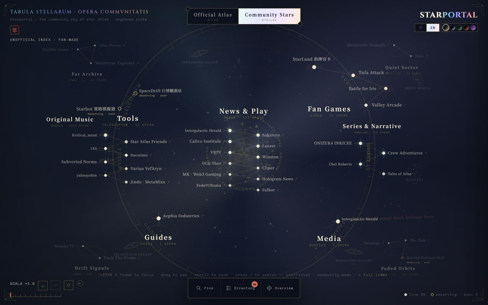
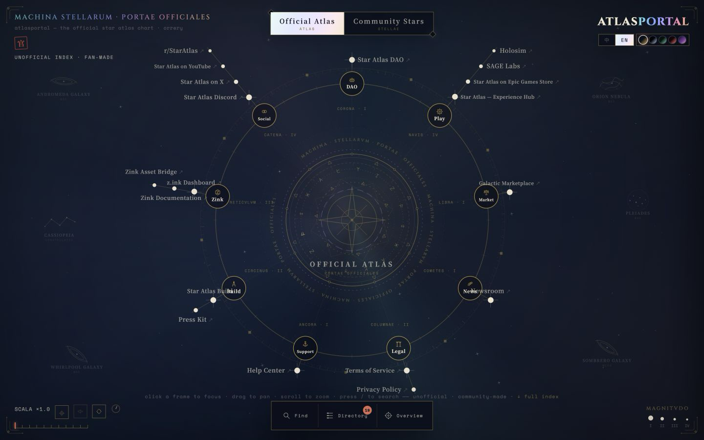
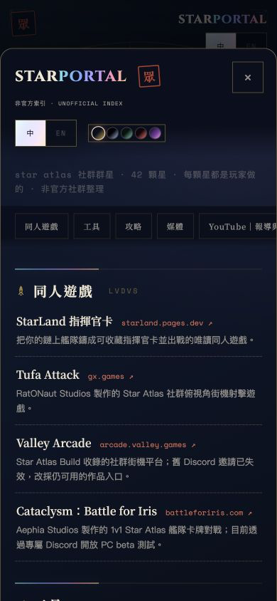
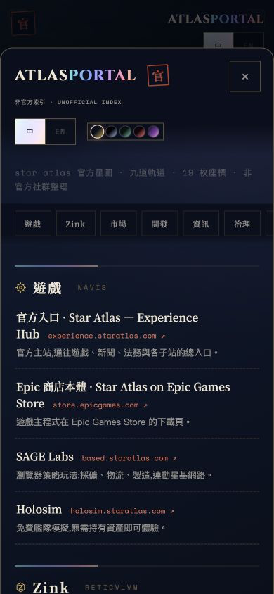

<div align="center">

# Star Portals

**Find your next stop in the Star Atlas universe.**

Two interactive star maps. Community creations and official destinations, each with its own sky.

**[Explore community projects](https://starportal.pages.dev/en/)** · **[Find official destinations](https://atlasportal.pages.dev/en/)**

[繁體中文](README.zh-TW.md) · [Suggest a link](https://github.com/StarAtlasFleet/star-portals/issues/new/choose) · [Contribute](CONTRIBUTING.md)

</div>

[](https://starportal.pages.dev/en/)

*Star Portal — a constellation of things made by the community. Click the image to explore.*

## Choose a portal

| | What you will find | Visit |
|---|---|---|
| **Star Portal** | Fan games, tools, guides, reporting, stories and original music | [English](https://starportal.pages.dev/en/) · [繁中](https://starportal.pages.dev/) |
| **Atlas Portal** | Official game, marketplace, DAO, developer, support and social destinations | [English](https://atlasportal.pages.dev/en/) · [繁中](https://atlasportal.pages.dev/) |

Both portals are **independent, unofficial community projects** by [StarAtlasFleet](https://github.com/StarAtlasFleet). Atlas Portal organizes links to official services; the portal itself is not an official service. Neither site is affiliated with or endorsed by ATMTA, Inc. A listing is not an endorsement.

## Explore the sky. Find the link.

Pan and zoom through an engraved star chart, focus on a constellation, or open the directory when you already know what you need.

- **A map you can explore:** community works form constellations; official destinations orbit an astronomical instrument.
- **A directory you can use:** search by name, jump between categories, and read a short description before leaving the portal.
- **Two languages:** English and Traditional Chinese, with a switch between the sister sites.
- **Your preferred atmosphere:** five colour themes, optional sound and a reduced-motion control.
- **A simple foundation:** static HTML, CSS and JavaScript, plus a complete directory that remains readable without JavaScript.

[](https://atlasportal.pages.dev/en/)

*Atlas Portal — a community-maintained map of official destinations. Click the image to explore.*

### On a smaller screen

The directory opens over the map, keeping categories, descriptions and destination links within reach. These captures show the Traditional Chinese interface.

<table>
  <tr>
    <th>Star Portal · Community</th>
    <th>Atlas Portal · Official destinations</th>
  </tr>
  <tr>
    <td align="center"><a href="https://starportal.pages.dev/"></a></td>
    <td align="center"><a href="https://atlasportal.pages.dev/"></a></td>
  </tr>
</table>

Screenshots are unedited captures of the live sites at desktop and mobile viewport sizes. [Capture details and provenance](docs/screenshots/manifest.json).

## Add a star to the map

Made something for Star Atlas? Found a creator we missed, a broken link, or a description that needs correcting? **[Open a link request or bug report](https://github.com/StarAtlasFleet/star-portals/issues/new/choose).** You do not need to write code.

Include the public homepage, creator name, category and a short explanation of its connection to Star Atlas. English and Traditional Chinese are welcome. Submissions are reviewed, and the maintainer's own projects follow the same rules as everyone else's.

For code, translation or data contributions, see [Contributing](CONTRIBUTING.md) and the [directory rules](docs/DIRECTORY_POLICY.md). Please keep private conversations, credentials and unlicensed artwork out of public submissions.

## Run it locally

Use **Node.js 22.23.1**. No dependency installation, account, wallet or API key is needed to run the portals.

```sh
git clone https://github.com/StarAtlasFleet/star-portals.git
cd star-portals
node scripts/serve-portals.mjs 4178
```

Open [Star Portal](http://127.0.0.1:4178/starportal/?sound=0) or [Atlas Portal](http://127.0.0.1:4178/atlasportal/?sound=0). Automated previews use `?sound=0` to stay silent.

### Keep the directory in sync

| Path | Purpose |
|---|---|
| `data/links.json` | Shared directory source, including each entry's verification date |
| `data/links.schema.json` | Data contract |
| `starportal/` · `atlasportal/` | Independently hostable sites; Traditional Chinese at `/`, English at `/en/` |
| `scripts/` | Dependency-free local server, generator and checks |
| [docs/LINK_DIRECTORY.md](https://github.com/StarAtlasFleet/star-portals/blob/main/docs/LINK_DIRECTORY.md) | Generated directory of all entries |

Edit the shared data. For a new entry, also add its map node in the relevant site's Chinese `index.html`; the generator does not choose positions. Then run:

```sh
node scripts/generate-portal-seo.mjs
node scripts/generate-portal-seo.mjs --check
node scripts/check-portals.mjs
```

The generator synchronizes data mirrors, English pages, static directories and SEO files. Do not edit those generated outputs directly. Checks confirm consistency; they do not re-verify every external destination. Consult each entry's `checkedAt` date and evidence.

### Host your own version

Serve each site's directory as a separate static site. Set your own base and sister-site URLs in the generator and checker, regenerate, and verify before publishing. No deployment credentials or automatic deployment are included. The live sites can differ from the newest source release.

## License and credits

Original code, Portal artwork and directory descriptions are available under [MIT](LICENSE). Star Atlas and creator trademarks, linked works and fonts retain their own rights; MIT does not grant rights to those materials. No official ship artwork is bundled.

The interface requests Cinzel, Noto Serif TC and Space Mono from Google Fonts, with local fallback fonts. See [third-party notices](THIRD_PARTY_NOTICES.md) for attribution and asset boundaries.

Built and maintained by [GJLMoTea](https://github.com/gjlmotea) as part of [StarAtlasFleet](https://github.com/StarAtlasFleet). Contributions help keep the map useful for the next explorer.
